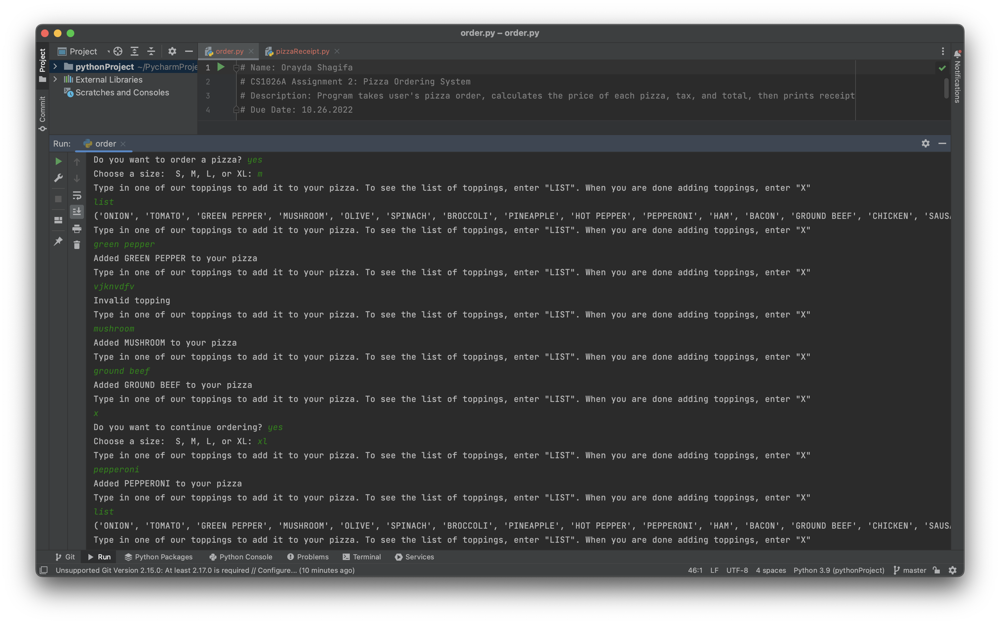
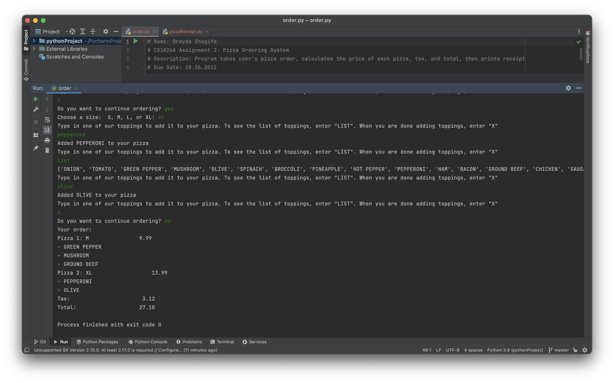

# PizzaOrder
This program is a pizza ordering system. The program takes the user's pizza order, calculates the price of each pizza, tax, and total, and then prints a receipt.

# Demo

# Technical Stack
Python
